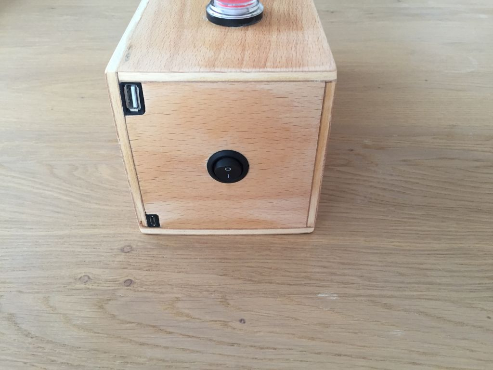
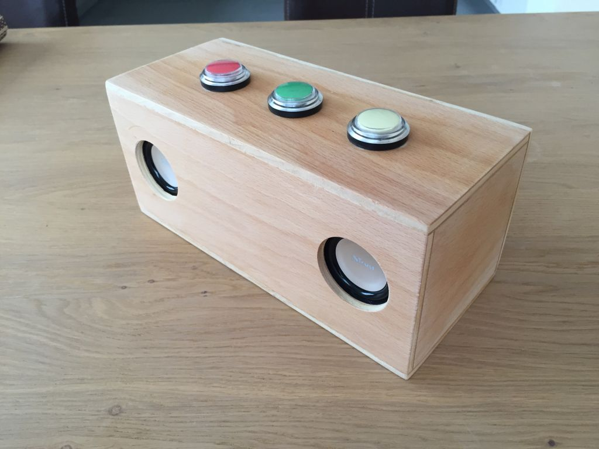
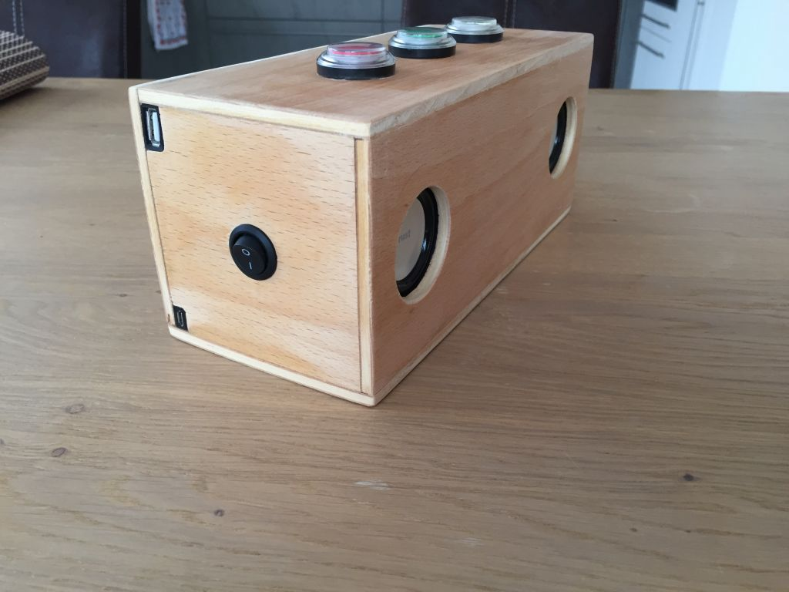

# GodfatherSays
Musicbox &amp; Kids Game for Raspberry PI

Made for my godchild Louisa :)


See demo on YouTube:

<a href="http://www.youtube.com/watch?feature=player_embedded&v=PWkdlJ0F5B8" target="_blank"></a>


## Features

- GodfatherSays Game
- MusicBox playback
- Audiobook playback
- Easter Egg
- Playback from USB device


## Software

Requirements:
 -  Raspbian 8 (Jessie) - WITH GUI for auto mount of new USB devices


## Hardware

- Raspberry PI
- 3 GPIO Buttons
- 3 LED
- Speaker
- Powerbank


## Build

! Sound (wav) files are not included !

Different wav files are needed to give a audio feedback for menu switch, startup and some of them are necessary for the GodfatherSays game.
The names of the different sound files can be configured in config.properties.
Copy your own wav files to "src/resources/wav/". The resources have to be included in the jar file.

And finally create a runnable jar file with "Extract required libraries to generated JAR".


## Configuration

1) Copy Binaries to "/home/pi/GodfatherSays/GodfatherSays.jar".

2) Copy you config file to "/home/pi/GodfatherSays/config.properties".

3) Copy MP3 files to the configures paths from your config.properties. Default: "/home/pi/Music" & "/home/pi/Hoerspiel"

4) Configure autostart:

```bash
sudo nano /etc/init.d/GodfatherSays
```

Paste content of docs/init.d.txt

```bash
cd /etc/init.d/
sudo chmod 755 GodfatherSays
sudo update-rc.d GodfatherSays defaults
```


## Some more images






